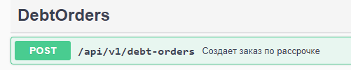
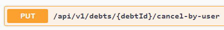
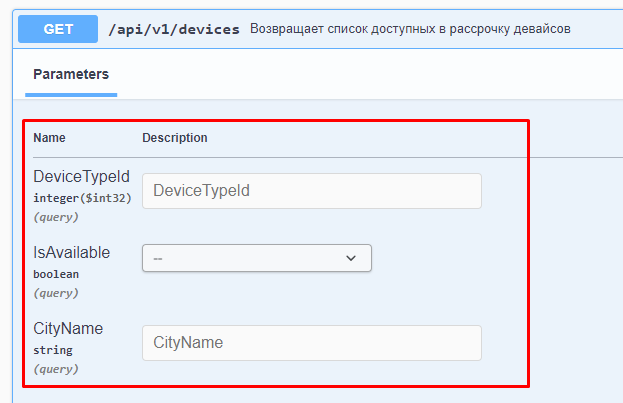
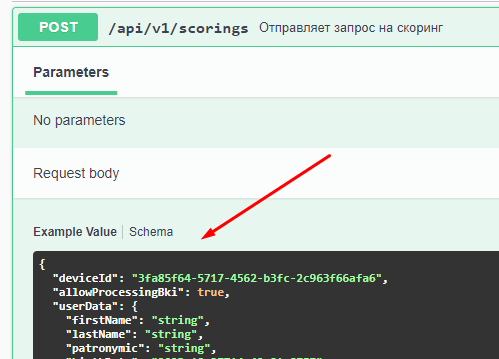
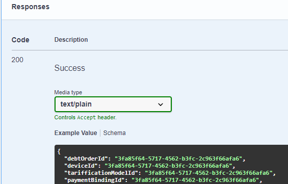
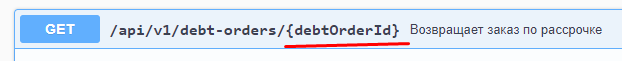

# СПИЗЖЕНО С РАБОТЫ

Набор классов и [DTO](https://en.wikipedia.org/wiki/Data_transfer_object) для обращения к бэкенду.

## Структура и нейминг

### DTO

Здесь располагаются **ТОЛЬКО** объекты, которые приходят напрямую из бэкенда.
Если необходимо использовать какие-то общие интерфейсы данных не связанные
напрямую с бэкендом, то они размещаются в папке `model`.

#### Имя объекта

На примере `debt-order-dto`.



Контроллер называет DebtOrders поэтому все сущности в нем начининаются c
`DebtOrder`.
После названия указывается тип метода: `Get`, `Post`, `Put` и т.п.

Параметры из урла игнориуются и в имени модели не указываются.



Для данного примера модель dto будет `DebtsCancelByUserPut`

#### Имя файла

Файл имеет название `[controller]-dto.ts`. Если в контроллере очень много метод или
больших моделей, чтобы не делать файл слишком большим допускается разбиение его на части.
Имя файла при этом принимает вид по аналогии с именами объектов.

```
debts-dto.ts  /api/v1/debts
debts-devices-dto.ts /api/v1/debt/{debtId}/devices
```

#### Версия

По умолчанию везде используется версия api v1 и в имени файла она не фигурирует.
Поскольку начиная с версии v2 модели могут очень сильно отличаться и есть вероятность
того, что может потребоваться поддерижвать обе версии, то начиная с версии v2 она
должна фигурировать в имени.

Структура типа

```
/api/[method]/[version]/[names]/
```

превраща в

```
[Names][Version][Method]
```

Пример

```
DevicesGet   - GET /api/v1/devices
DevicesV2Get - GET /api/v2/devices
```

#### Get

Слово `Get` предполагает, что возвращает единичный объект. Если возвращается
массив объектов, то используется `GetList`

_Пример_

```
GET /api/v1/devices - список всех девайсов
Имя dto - DevicesGetList

GET /api/v1/devices/{devicesId} - конкретный девайс
Имя dto - DevicesGet
```

#### Body, Query, Params,

`DebtOrderPost` в чистов виде нигде не используется. После метода необходимо
указать на источник данных.

**Query** - дополнительные параметры

_Пример_ - `DevicesGetQuery`



**Body** - тело запроса, которое передается в Post или Put

_Пример_ - `ScoringsPostBody`



**Return** - объект, который возвращается в запросе

_Пример_ `GET /api/v1/debt-orders/{debtOrderId}`

`DebtOrdersGetReturn`



**Params** - поскольку параметр всегда один, и в редких случаях их может быть два
то для них объекты не используются. Для всех остальных в обязательном порядке объявляются
указанные типы, даже если они состоят из одного поля.



#### Вложенные типы

DTO копируются полностью, без разбиения и без наследования.

```typescript
// ❌ - Неправильно
export interface TarifficationModel {
  price: number;
}

/** GET /api/v1/devices/{deviceId} */
export interface DevicesGetRetun {
  name: string;
  tarifficationModel: TarifficationModel;
}
```

```typescript
// ❌ - Неправильно
export interface DeviceInfo {
  description: string;
}

/** GET /api/v1/devices/{deviceId} return */
export interface DevicesGetRetun extends DeviceInfo {
  name: string;
}
```

```typescript
// ✅ - Правильно

/** GET /api/v1/devices/{deviceId} return */
export interface DevicesGetRetun {
  name: string;
  description: string;
  tarifficationModel: {
    price: number;
  };
}
```

Если нужно получить вложенный тип данных, то используются `Pick`, `Omit`, `PickType` и т.п.
Побочные типы можно также мержить с помощью `&` или `|`.

#### PickType

Тип, который получает тип поля по имени, близо по смыслку к `Pick<Type, Keys>`

```typescript
interface User {
  userName: string;
  role: {
    roleId: number;
    roleName: string;
  };
}

type Role = PickType<User, 'role'>;

const role: Role = {
  roleId: 10,
  roleName: 'Test',
};
```

#### PickArrayElement

Тип, который используется, чтобы получить элемент массива

```typescript
/** GET /api/v1/external-links return */
export type ExternalLinksGetListReturn = {
  key: string;
  externalLink: string;
}[];

export type ExternalLinkGetItem = PickArrayElement<ExternalLinksGetListReturn>;

const element: ExternalLinkGetItem = {
  key: 'googleLink',
  externalLink: 'https://google.com',
};
```

#### ItemListDto

Этот тип описывает массив, который используется вместе с пагинацией. В поле `itemsCount`
передается общее количество элементов в бэке, а в `items` только срез элементов.

Тип элемента можно получить с помощью комбинации `PickType` и `PickArrayElement`.

```typescript
/** GET /api/v1/catalog return */
export type CatalogGetListReturn = ItemsListDto<{
  name: string;
  price: number;
  imageUrl: string;
}>;

export type CatalogGetItem = PickArrayElement<PickType<CatalogGetListReturn, 'items'>>;
```

#### Комментарий jsdoc

Используется для удобного поиска. Состоит из 3 частей:

`[method] [url] [type]`

_Пример_

```typescript
/** GET /api/v1/devices query */
export interface DevicesGetQuery {
  /* */
}

/** POST /api/v1/devices body */
export interface DevicesPostBody {
  /* */
}
```

Комментарий указывается ТОЛЬКО к связанному с бэкендом dto, а не к его производным.

#### Put и Field

`TODO Добавить`

#### FAQ

##### Зачем так сделано?

Модели Get, Post, Put могут отличаться на несколько полей, они могут добавляться и удаляться. Если dto состоит
из нескольких интерфейсов и они лежат в разных файлах их очень сложно синхронизировать с бэком. А так достаточно
будет полностью скопировать по-новой все поля и все расхождения в побочных моделях сразу всплывут.

##### А если модели GET и POST полностью совпадают

dto нужны для отражения моделей бэкенда. Соответственно, есть модели, которые отражают отдельно для GET и
отдельно для POST. И абсолютно не важно совпадают у них поля или нет. Например, у нас есть две модели на
40 полей. Нужно ли сидеть и сверять в них поля или нет.

##### Зачем нужна папка `legacy`?

Чтобы не переписывать половину проекта, когда нужно быстро перекинуть репозиторий из legacy проекта.

##### Можно ли это автоматизировать?

Да, данные из сваггера передаются в json формате. Есть утилиты, которые позволяют автоматически создавать
интерфейсы. Но это надо ресечить.

### Repository

Задача репозитория - избавить разработчика от таких задач, как аутентификация,
выбор урла бэкенда, обработка http запросов и т.д. Каждый конкретный репозиторий
является отражением конкретного контроллера бэкенда. Его методы отражают методы
контроллера.

- Для простый REST запросов используются get, post, put, delete.
- Для методов с опрделенным названием используется это называние. Например,
  метод `POST /api/v1/debt-orders/create-debt` - `createDebt()`

Репозитории, которые используется в этом проекте, должны вызывать только с
клиентской части. Если необходимо вызвать с сервера, то репозиторий должен
располагаться в `@shareit/data-server`. Это связанно исключительно с
особенностью компиляции Nextjs.
